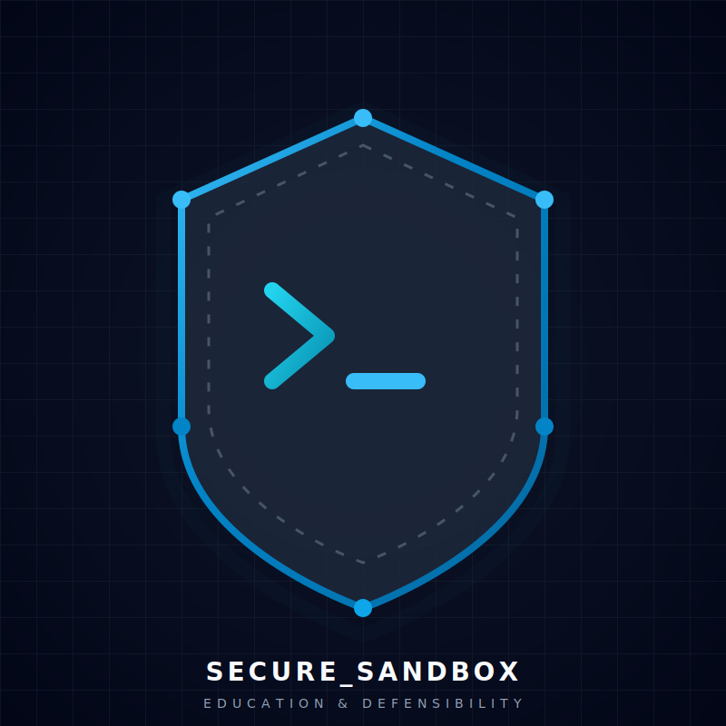
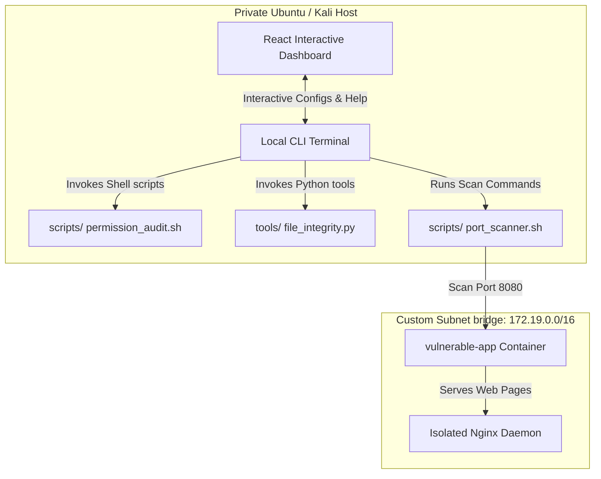
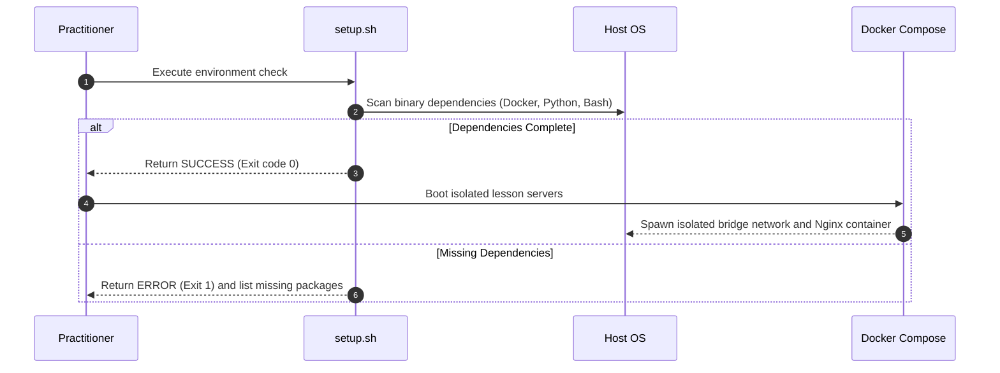

# 🛡️ Secure Sandbox: Ethical Hacking Labs Workstation & Playground

<div align="center">
  
  <h3>An Elite, Automated Educational Laboratory Environment & Sandbox Repository</h3>
  <p><i>Mastering linux system administration, socket diagnostics, secure scripting, and privilege auditing loops in safe, containerized sandboxes.</i></p>

  [](https://github.com/)
  [](LICENSE)
  [](https://github.com/)
  [](https://github.com/)
  [](https://github.com/)
</div>

---

## 📖 Table of Contents
* [🌟 Features & Project Highlights](#-features--project-highlights)
* [🗺️ Learning Syllabus & Objectives](#-learning-syllabus--objectives)
* [📐 Architecture Overview](#-architecture-overview)
* [💻 Technology Stack](#-technology-stack)
* [🚀 Quick Start & Lab Deployment](#-quick-start--lab-deployment)
* [⚙️ Configuration Defaults](#%EF%B8%8F-configuration-defaults)
* [📂 Folder & Directory Structure](#-folder--directory-structure)
* [📝 Command-Line Usage Examples](#-command-line-usage-examples)
* [📸 Dashboard Screenshot Reference](#-dashboard-screenshot-reference)
* [🎯 Interactive Workflow Sequences](#-interactive-workflow-sequences)
* [🛡️ Mandatory Security Notice](#%EF%B8%8F-mandatory-security-notice)
* [❓ FAQ](#-faq)
* [🔧 Troubleshooting Common Issues](#-troubleshooting-common-issues)
* [🤝 Contributing to Secure Sandbox](#-contributing-to-secure-sandbox)
* [🛣️ Development Roadmap](#%EF%B8%8F-development-roadmap)
* [📄 License & Credits](#-license--credits)

---

## 🌟 Features & Project Highlights

* **10 Progressive Lab Modules**: Transition from basic command shell syntax to complex SUID auditing, Docker sandbox escaping, and professional pentest report compilation.
* **Production-Grade Audit Scripts**: Fully compliant with `ShellCheck` and secure shell development standards (`set -euo pipefail`).
* **Python Integrity Monitors**: Complete implementation of SHA256 directory checkers and regex-based Nginx access-log analyzers.
* **Containerized Practice Sandboxes**: Standard Docker Compose network setups isolated on private bridge subnets.
* **Modern React Interactive Console**: A stunning dashboard compiling a live-simulated terminal, file inspector, manual selection system, and CVSS v3.1 calculator.

---

## 🗺️ Learning Syllabus & Objectives

| Module ID | Focus Area | Complexity | Time Frame | Core Learning Objective |
| :---: | :--- | :---: | :---: | :--- |
| **Lab 01** | Linux Systems Basics | Beginner | 45 Mins | Audit attributes, ownership profiles, and directory permission masks. |
| **Lab 02** | Sockets & Networks | Beginner | 60 Mins | Query listening TCP adapters using native socket tools (`ss`, `ip`). |
| **Lab 03** | Port Scan Discovery | Intermediate | 75 Mins | Extract web server banner responses to identify version signatures. |
| **Lab 04** | Vulnerability Auditing | Intermediate | 90 Mins | Automate global writeable directories searches across filesystems. |
| **Lab 05** | Isolated Web Sec | Advanced | 120 Mins | Secure SQL queries using parameter blocks on container endpoints. |
| **Lab 06** | Linux Privilege Esc | Advanced | 105 Mins | Detect and secure insecure root cron job paths and SUID binaries. |
| **Lab 07** | Windows Privilege Esc | Advanced | 120 Mins | Analyze AlwaysInstallElevated registries and quote gaps in service paths. |
| **Lab 08** | Docker Sandboxing | Advanced | 90 Mins | Mitigate escape vectors and restrict container execution parameters. |
| **Lab 09** | Auditing Write-ups | Intermediate | 75 Mins | Map technical risks to commercial matrices using CVSS metrics. |
| **Lab 10** | CTF Solver Flow | Intermediate | 60 Mins | Implement non-destructive structured testing to capture flags. |

---

## 📐 Architecture Overview

The workspace establishes a fully offline-ready sandbox. All auditing tools run locally on the workstation and interface exclusively with loopback interfaces or isolated Docker bridge networks.



---

## 💻 Technology Stack

* **Front-End Dashboard**: React 18, Vite, TypeScript, Tailwind CSS, Lucide Icons, and Motion transitions.
* **System Automation**: Pure GNU Bash Shell (`set -euo pipefail` standard).
* **System Programming**: Python 3.12 (Standard Library: `hashlib`, `collections.Counter`, `unittest`).
* **Container Orchestration**: Docker Engine & Docker Compose (v2 API).
* **CI/CD Quality Engine**: GitHub Actions Workflows (Automated Linting, Bash Testing, and Python Unittests).

---

## 🚀 Quick Start & Lab Deployment

### System Prerequisites
Ensure your local host workstation meets the following criteria:
* **Operating System**: Linux (Kali, Ubuntu 22.04 LTS+, or Debian 11+ recommended).
* **Command Utilities**: `bash`, `python3`, `pip3`, `docker`, and `docker-compose`.

### 1. Repository Installation
Clone the repository to your local directory and enter the workspace:
```bash
git clone https://github.com/aimadulislam/Secure-Sandbox-Ethical-Hacking-Labs.git
cd Secure-Sandbox-Ethical-Hacking-Labs
```

### 2. Environment Verification
Verify that your workstation possesses all vital system libraries by invoking the secure prerequisite checker:
```bash
chmod +x scripts/setup.sh
./scripts/setup.sh
```

### 3. Spin Up Vulnerable Container Sandboxes
Prepare the local sandboxed network and compile the vulnerable lesson server:
```bash
docker compose -f docker/docker-compose.yml up -d
```

### 4. Run Audits & Security Checks
Verify network exposure of the container targets:
```bash
chmod +x scripts/port_scanner.sh
./scripts/port_scanner.sh -t 127.0.0.1 -p 8080 -v
```

---

## ⚙️ Configuration Defaults

The workspace can be globally tailored by editing the default settings profiles:

* **YAML Configuration (`config/config.yaml`)**:
  ```yaml
  lab_defaults:
    target_host: "127.0.0.1"
    default_ports: [80, 443, 8080]
    log_level: "INFO"
    enable_color: true
    isolation_mode: "internal"
  ```
* **INI Configuration (`config/settings.ini`)**:
  ```ini
  [lab]
  target_host = 127.0.0.1
  default_ports = 80,443,8080
  log_level = INFO
  ```

---

## 📂 Folder & Directory Structure

```text
Secure-Sandbox-Ethical-Hacking-Labs/
├── .github/                # Automation triggers
│   └── workflows/
│       └── ci.yml          # GitHub Actions continuous integration suite
├── config/                 # Central settings files
│   ├── config.yaml         # Global settings (YAML profile)
│   └── settings.ini        # Diagnostic settings (INI profile)
├── docs/                   # Academic guides and cheat sheets
│   ├── branding/           # Brand files (SVGs, guidelines)
│   │   ├── logo.svg
│   │   ├── favicon.svg
│   │   └── brand_guidelines.md
│   ├── ctf_methodology.md
│   ├── linux_basics.md
│   ├── networking.md
│   ├── priv_esc.md
│   └── web_security.md
├── docker/                 # Sandboxed environment containers
│   ├── docker-compose.yml  # Isolated network driver
│   └── vulnerable-app/     # Container web lesson server files
│       ├── Dockerfile
│       ├── index.html
│       └── styles.css
├── labs/                   # Guided hands-on laboratory manuals
│   ├── lab01_linux.md      # Permissions and basic commands
│   ├── lab02_networking.md # Socket networking basics
│   ├── lab03_enumeration.md # Port scanners and banner grabs
│   ├── lab04_vuln_assessment.md # System configuration scanners
│   ├── lab05_web_security.md # Docker parameterization
│   ├── lab06_linux_privesc.md # Linux SUID cron audits
│   ├── lab07_win_privesc.md # Windows Service quote issues
│   ├── lab08_docker.md     # Docker least-privilege users
│   ├── lab09_reporting.md  # Reporting structures and CVSS
│   └── lab10_ctf_workflow.md # Structured non-destructive playbooks
├── scripts/                # GNU Bash automation tools
│   ├── setup.sh            # Complete environment validator
│   ├── port_scanner.sh     # Lightweight socket-level port tester
│   ├── permission_audit.sh # Deep permission configuration auditor
│   └── reset_lab.sh        # Sandboxed target refresher
├── templates/              # Academic reporting templates
│   └── report_template.md  # Standard reporting markdown template
├── tests/                  # Robust test suites
│   ├── test_file_integrity.py # Python unittest verifying file baselines
│   ├── test_log_analyzer.py # Python unittest verifying log patterns
│   └── test_scripts.sh     # Shell verification suite
├── tools/                  # Python utility tools
│   ├── file_integrity.py   # Baseline integrity tracking utility
│   └── log_analyzer.py     # Nginx access log parser
├── src/                    # React frontend application
│   ├── App.tsx             # Interactive dashboard
│   ├── index.css           # Tailwind configurations
│   └── main.tsx            # App entry point
├── package.json            # Front-end dependencies
└── tsconfig.json           # TS configurations
```

---

## 📝 Command-Line Usage Examples

### 1. File Integrity Baseline Tracker
Create a trusted hash profile of a system folder:
```bash
python3 tools/file_integrity.py --dir config/ --create
```
To verify if configuration parameters have been altered or tampered with:
```bash
python3 tools/file_integrity.py --dir config/ --verify baseline.json
```

### 2. Nginx Web Log Parser
Examine network logs to flag active brute force attempts (HTTP 401 Authorization Bursts):
```bash
python3 tools/log_analyzer.py --log /var/log/nginx/access.log
```

### 3. Automated SUID and Write Permission Scanner
Scan host workstation paths to identify weak access privileges:
```bash
./scripts/permission_audit.sh
```

---

## 📸 Dashboard Screenshot Reference

*The modern client-side React dashboard exposes several functional workspaces:*
1. **Overview Canvas**: Track system components compliance and visualize file structures in a glowing responsive file-explorer.
2. **Laboratory Syllabus**: Navigate manuals directly inside a styled markdown-viewer paired with copyable terminal macros.
3. **Simulated Shell**: Execute diagnostic command macros or write customized commands inside a colorized monospace output terminal.
4. **Findings & Reports**: Build structured penetration test write-ups, prioritize vulnerabilities, and compile assessment matrices directly into standard markdown blocks.
5. **Interactive CVSS Calculator**: Slide attack complexity vectors dynamically to evaluate real-time threat ratings (Critical, High, Medium, Low).

---

## 🎯 Interactive Workflow Sequences

### Laboratory Setup & Validation Lifecycle



---

## 🛡️ Mandatory Security Notice

> **📢 IMPORTANT LEGAL DISCLAIMER**
> 
> * This software repository is designed strictly as an academic sandbox for cyber defense research and authorized security assessments.
> * **DO NOT** execute any scripts, scans, or software commands against external web infrastructure, public network addresses, or servers for which you lack explicit, written authorization.
> * The maintainers of this project accept zero responsibility or liability for unauthorized usage, security breaches, or system disruptions occurring due to deviations from localized safety bounds.

---

## ❓ FAQ

#### Q: Can I run this laboratory workstation on Windows?
**A**: Yes, but you must utilize **WSL 2** (Windows Subsystem for Linux) with a distro such as Ubuntu, as the core shell utilities depend directly on native Linux subsystems (like `/dev/tcp` sockets).

#### Q: Does the port scanner script require root privileges?
**A**: No. The custom `port_scanner.sh` script leverages user-space Bash socket redirection (`/dev/tcp/...`), which operates cleanly without administrative permissions.

#### Q: How do I refresh a container if the database becomes corrupted during a lab?
**A**: Simply run `./scripts/reset_lab.sh` to purge containers, clear volumes, and spin up fresh, clean containers in less than 5 seconds.

---

## 🔧 Troubleshooting Common Issues

1. **Issue: Port scanner reports all ports as `CLOSED` when containers are running.**
   * *Resolution*: Ensure your Docker daemon is fully started and listening on localhost, and check if you ran the setup with administrative boundaries. Verify via `docker ps` that the containers list shows port `8080` bound to `127.0.0.1`.
2. **Issue: Execution error: `/bin/bash^M: bad interpreter`.**
   * *Resolution*: This is caused by Windows-style CRLF line endings. Convert file formats to Unix standards by executing: `sed -i -e 's/\r$//' scripts/*.sh`.
3. **Issue: Python `ModuleNotFoundError` during integrity scans.**
   * *Resolution*: Ensure you are running python natively with the standard library (`python3`). The tools require no external PIP packages.

---

## 🤝 Contributing to Secure Sandbox

We welcome improvements and feedback! To contribute:
1. Ensure your scripts fully comply with `ShellCheck` guidelines.
2. Maintain local loopback boundaries in all pull requests—we strictly reject any submissions containing malicious exploits or un-sandboxed tools.
3. Review our complete [CONTRIBUTING.md](CONTRIBUTING.md) guide for PR requirements.

---

## 🛣️ Development Roadmap

* [x] **v1.0.0**: Stabilize baseline automation scripts, write 10 exhaustive manuals, and build the React dashboard interface.
* [ ] **v1.1.0**: Integrate an automated static-site generator (MkDocs/Material) to host documentation on GitHub Pages.
* [ ] **v1.2.0**: Implement isolated multi-host scenario targets inside Docker network topologies (VLAN simulation).
* [ ] **v1.3.0**: Add defensive log alerts to detect directory traversal sweeps in real time.

---

## 📄 License & Credits

* **License**: This repository is licensed under the open-source **MIT License** (see [LICENSE](LICENSE) for details).
* **Credits**: Designed and maintained by security educators, portfolio developers, and system engineers. Badges generated via [Shields.io](https://shields.io/).
