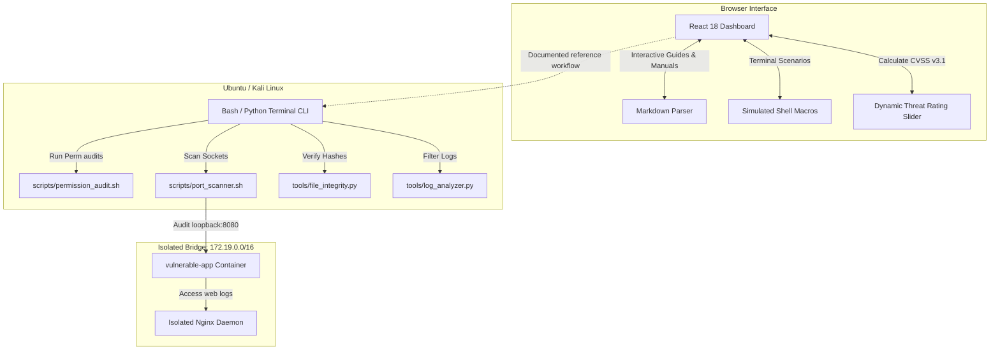
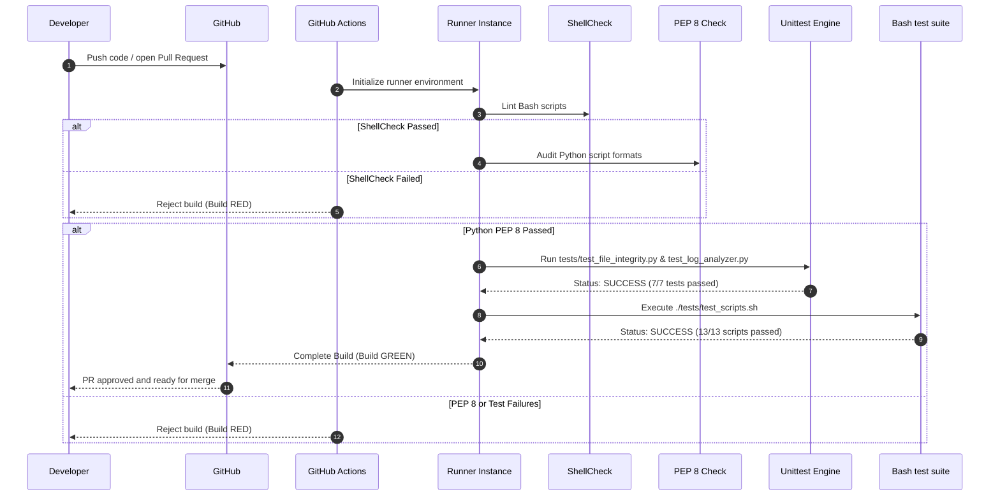
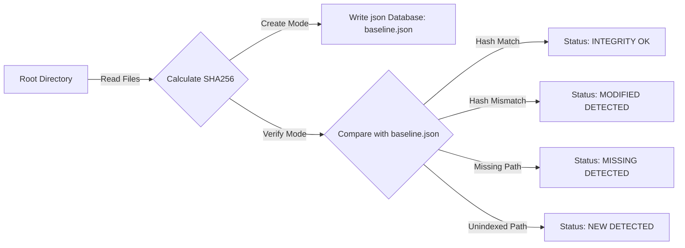

# Architecture: System Design & Network Layout 📐

This document outlines the system architecture, network topology, and execution flows of the **Secure Sandbox Workstation** environment.

---

## 🏗️ 1. Conceptual System Architecture

The environment isolates automated security testing and script execution on the local host machine, preventing exposure or risks to wider network boundaries.



---

## 🌐 2. Isolated Docker Subnet Topology

The target lab server runs on a private bridge subnet, allowing you to practice socket diagnostics and port scanning safely without exposing the container to external networks.

```text
  +-------------------------------------------------------+
  |              Host Workstation Loopback                |
  |                      127.0.0.1                        |
  +-------------------------------------------+-----------+
                                              |
                                              v (Port Bind: 127.0.0.1:8080)
  +-------------------------------------------+-----------+
  |            Isolated Docker Bridge Network             |
  |                Subnet: 172.19.0.0/16                  |
  |                                                       |
  |   +-----------------------------------------------+   |
  |   |           vulnerable-app Container            |   |
  |   |               IP: 172.19.0.2                  |   |
  |   |         Active Daemon: Nginx (Port 80)        |   |
  |   +-----------------------------------------------+   |
  +-------------------------------------------------------+
```

---

## 🛠️ 3. Quality Control & Continuous Integration (CI)

Our quality pipeline runs on every code submission to verify script compliance and ensure the stability of our diagnostic utilities.



---

## 📊 4. File Integrity Monitoring Verification Flow

Our file integrity checking utility follows a structured workflow to establish file baselines and identify modifications or tempering:


By isolating these components, we maintain high stability, consistent test performance, and clear safety limits across our exercises.
