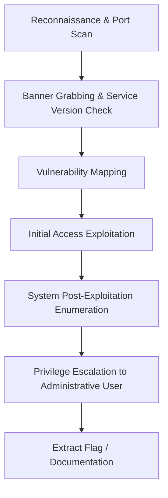

# Capture The Flag (CTF) Methodological Playbook

## The Standard Flag Lifecycle
A structured model for solving CTF environments sequentially without wasting computational power or hours.



## Step-by-Step Methodology Checklist

### 1. Active Reconnaissance
- Scan target ports using the local loopback check script.
- Document listening ports in your Markdown report template.

### 2. Service Profiling
- Query version banners of active endpoints:
  ```bash
  curl -I http://localhost:8080
  ```

### 3. Privilege Escalation
- Audit SUID binaries and environment variables.
- Read `/etc/passwd` to identify usernames.

### 4. Reporting
- Fill the templates under `/templates/report_template.md`.
- Export results to JSON, HTML, or CSV using the python reporting scripts.
