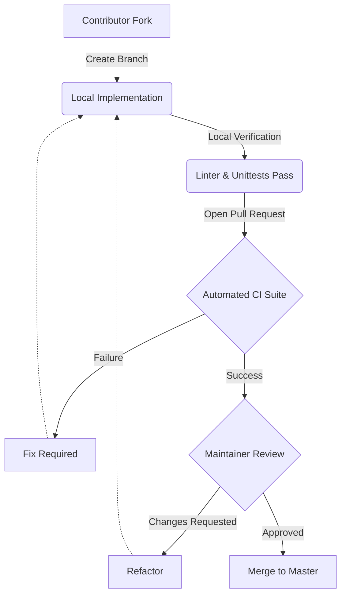

# 🏛️ Open Source Project Governance & Maintainer Handbook

This document outlines the governance model, operational workflows, decision-making processes, and maintenance guidelines for the **Secure Sandbox Laboratory Workstation**.

---

## 👥 1. Governance Model

The **Secure Sandbox** operates under a **Benevolent Dictatorship / Active Maintainer Consensus** model. This structure ensures clear accountability, rapid response times for security disclosures, and architectural consistency.

### Governance Roles
* **Project Lead / Benevolent Dictator**: Holds final decision-making power on architectural direction, release approvals, and governance rules.
* **Core Maintainers**: Experienced contributors with write access to the main repository. They participate in triage, pull request reviews, and help formulate development roadmaps.
* **Contributors**: Any community member who submits code, bug reports, documentation updates, or feedback.

---

## 📘 2. Maintainer Handbook

Maintainers have specific responsibilities to ensure the project remains healthy, secure, and welcoming.

### Core Duties
1. **Pull Request Triage**: Review and merge contributions in alignment with our [Merge Policy](#4-merge-policy).
2. **Issue Management**: Label, categorize, and prioritize issues within 48 hours of submission.
3. **Security Audits**: Actively monitor dependency alerts, inspect PRs for insecure execution patterns, and respond to vulnerability disclosures.
4. **Community Engagement**: Guide new contributors, answer discussions, and maintain a welcoming environment in compliance with our [Code of Conduct](CODE_OF_CONDUCT.md).

---

## 🧠 3. Decision-Making Process

We strive for consensus-based decision-making. However, when consensus cannot be reached, the Project Lead makes the final decision.

### Operational Lifecycle
1. **Discussion**: Complex changes are proposed and debated in GitHub issues or discussions.
2. **RFC (Request for Comments)**: For major architectural adjustments (e.g., changing container orchestration standards), an RFC document is drafted and discussed.
3. **Consensus**: Core maintainers vote (`+1` / `-1`). If consensus is achieved, development proceeds.
4. **Escalation**: If maintainers remain deadlocked, the Project Lead reviews the proposals and issues a final, binding decision.

---

## 🔄 4. Contribution Workflow & Merge Policy

To maintain high code quality and script security, all contributions must undergo a strict validation and review process.

### Pull Request Review Checklist
Before any PR can be merged, a core maintainer must verify the following:
* [ ] **Automated CI Validation**: The continuous integration pipeline must be fully green.
* [ ] **ShellCheck & PEP 8 Compliance**: All modified or added shell scripts and Python tools must comply with linting standards.
* [ ] **Test Coverage**: New features or modules must include corresponding unit or integration tests.
* [ ] **Security Review**: The code must not introduce insecure shell expansions, hardcoded secrets, or unconstrained network listeners.
* [ ] **Documentation Updates**: Relevant lab manuals, guides, or references must be updated.

### Merge Policy
* **Two-Approver Rule**: PRs affecting core bash automation or container networking require approval from at least two maintainers.
* **No Direct Commits**: Committing directly to the `master` or `main` branch is strictly prohibited. All changes must go through pull requests.

---

## 🌿 5. Branch & Versioning Strategies

### Branching Model
We leverage a simplified **Git Flow / GitHub Flow** hybrid strategy:
* `master` (or `main`): The stable production-ready branch. All releases are tagged from this branch.
* `develop` (optional / active feature integration): The primary integration branch for the next minor release.
* `feature/*` or `fix/*`: Ephemeral branches created by contributors for targeted developments.

### Versioning Policy (Semantic Versioning 2.0.0)
We strictly follow **Semantic Versioning (SemVer)**:
* **MAJOR** (`X.y.z`): Introduced when backward-incompatible changes are made (e.g., restructuring the entire CLI wrapper syntax).
* **MINOR** (`x.Y.z`): Introduced when backward-compatible features are added (e.g., adding a new lab module or automated utility).
* **PATCH** (`x.y.Z`): Introduced for backward-compatible bug fixes, security patches, or documentation updates.

---

## 🗑️ 6. Deprecation & Support Policies

### Deprecation Policy
To ensure stable progression:
1. **Notice**: A deprecation notice will be added to release notes and console outputs at least one minor release prior to removal.
2. **Coexistence**: Deprecated parameters or tools will remain active alongside replacements during the deprecation period.
3. **Removal**: Deprecated components are removed only in the next major version release.

### Support Policy & Lifecycles
* **Active Support**: The latest major version receives active feature additions, optimization, and bug fixes.
* **Long-Term Support (LTS)**: Prior major versions receive critical security patches for 12 months following a new major release.
* **End of Life (EOL)**: Legacy major versions older than 12 months are considered EOL and receive no updates.
