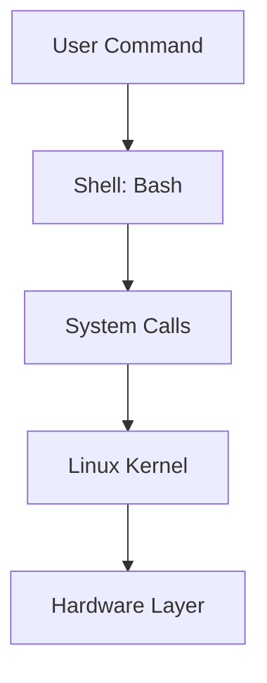
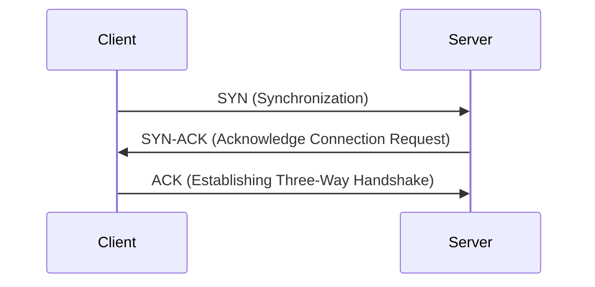
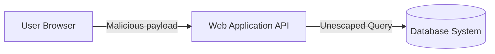

# Linux & System Administration Cheat Sheet

## Essential Navigation & Commands
- `ls -lah`: Lists all directory contents, including hidden files, permissions, and exact sizes.
- `find /path -name "*.conf" 2>/dev/null`: Searches for config files while discarding permission-denied errors.
- `cat /etc/passwd | cut -d: -f1`: Extracts all user names on the host machine.
- `journalctl -u docker.service --since "1 hour ago"`: Inspects Docker daemon logs.



## Defensive Permissions Auditing
To check for SUID/SGID binary misconfigurations, run:
```bash
find / -perm -4000 -type f 2>/dev/null
```
- **SUID (Set User ID)** allows a file to execute with root permissions. Improper permissioning can lead to vertical escalation.

---

# Networking, Sockets & Protocol Cheat Sheet

## Diagnostic Cheat Sheet
- `ip a`: Inspect active interface adapters and address bindings.
- `ss -tulpn`: Check listening TCP/UDP sockets with process ID bindings.
- `dig axfr @ns.example.local example.local`: Run simulation zone transfers in DNS testing environments.



---

# Web Application Security Foundations

## The OWASP Top 10 Framework
A standard advisory framework listing the top web security vulnerabilities:
1. **Broken Access Control**: Privilege bypasses, direct object reference leaks.
2. **Cryptographic Failures**: Unencrypted transit of secrets.
3. **Injection**: SQL Injection, Command Injection.
4. **Insecure Design**: Architectural flaws.
5. **Security Misconfiguration**: Default credentials, verbose logs.


