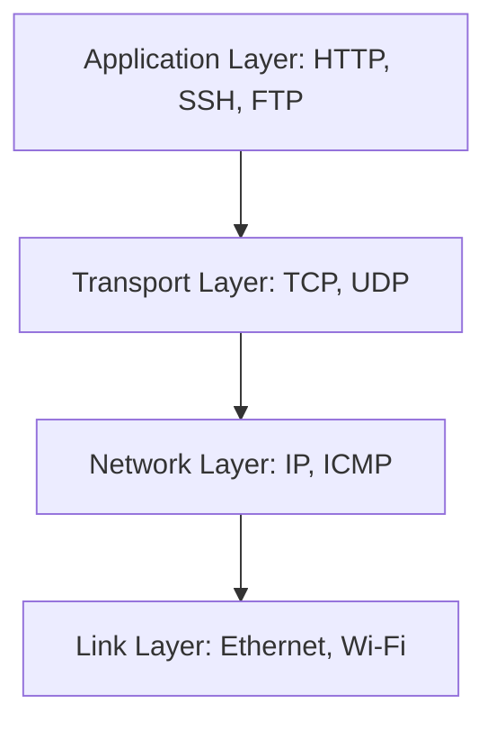

# Comprehensive Networking Foundations

## TCP/IP Stack & Socket Layer
The Transmission Control Protocol / Internet Protocol (TCP/IP) model governs data encapsulation and transit across networks.



### Essential Protocols & Diagnostic Overview

| Protocol | Port | Type | Educational Security Audit Objective |
| :--- | :---: | :---: | :--- |
| **DNS** | 53 | UDP/TCP | Query verification, zone transfer prevention |
| **HTTP** | 80 | TCP | Plaintext traffic sniffing demonstration, header audits |
| **HTTPS** | 443 | TCP | SSL/TLS certificate chain validation |
| **SSH** | 22 | TCP | Cryptographic key management, password auditing validation |
| **SMB** | 445 | TCP | Null session analysis, sharing audits |

### Hands-On Local Networking Commands
```bash
# Check active TCP listening ports and associated PIDs
ss -tulpn

# Check connection path to loopback simulation
traceroute 127.0.0.1

# Trace network route using system sockets
ping -c 4 127.0.0.1
```
