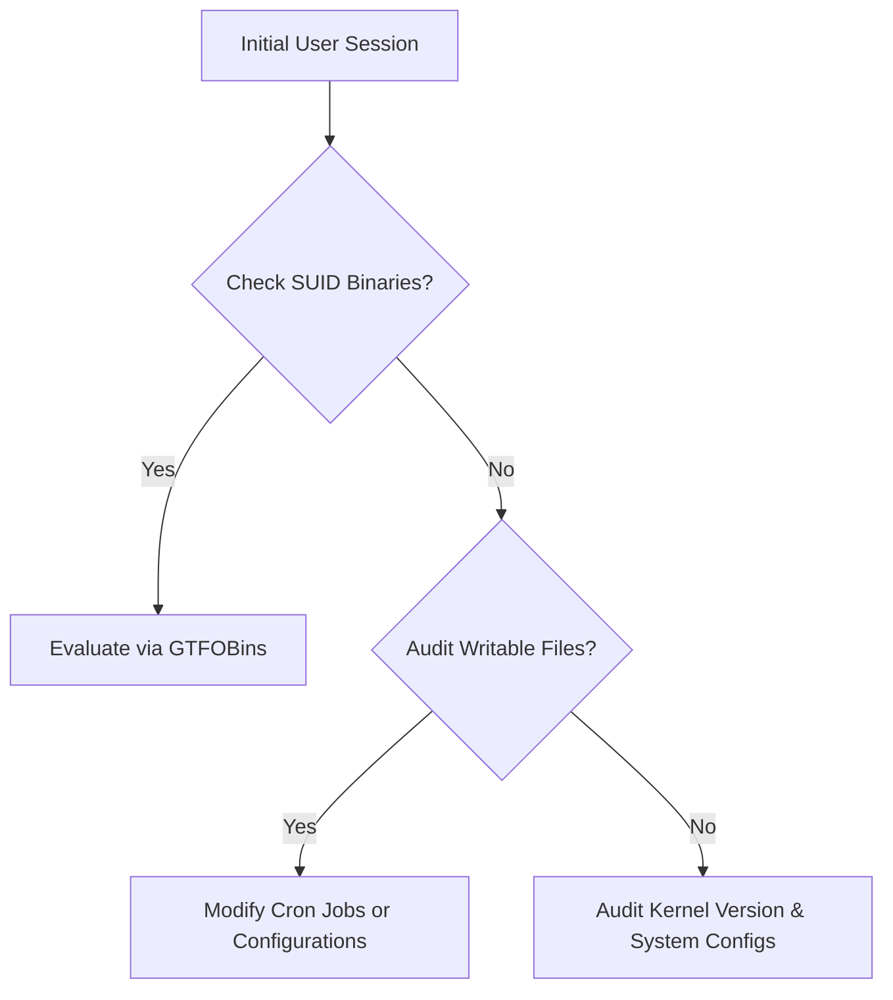

# System Privilege Escalation Methodology

## Linux Privilege Escalation Path
When a basic session is achieved on a local test target, escalating privileges requires identifying configuration anomalies.



### Core Audit Parameters

1. **SUID Permissions Checks**:
   ```bash
   find / -perm -4000 -type f 2>/dev/null
   ```
2. **Sudo Privileges Audit**:
   ```bash
   sudo -l
   ```
3. **Cron Job Configuration Check**:
   ```bash
   cat /etc/crontab
   ls -la /etc/cron.d/
   ```

---

## Windows Privilege Escalation Concepts

| Vector | Description | Check Command |
| :--- | :--- | :--- |
| **AlwaysInstallElevated** | Registry setting that permits MSI installations as SYSTEM | `reg query HKLM\SOFTWARE\Policies\Microsoft\Windows\Installer` |
| **Unquoted Service Paths** | Service path contains spaces and lacks wrapping quotes | `wmic service get name,displayname,pathname,startmode` |
| **Token Impersonation** | Exploit system processes running as higher privilege | `whoami /priv` |
