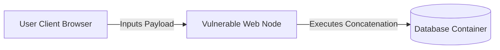

# Web Application Security Foundations

## The OWASP Top 10 Core Vectors
The Open Web Application Security Project (OWASP) defines critical flaws affecting modern dynamic APIs and web layers.



### Vulnerability Mechanics & Remediation

### 1. SQL Injection (SQLi)
- **Concept**: Occurs when unsanitized input is directly concatenated into a SQL statement.
- **Vulnerable Pattern**:
  ```php
  $query = "SELECT * FROM users WHERE username = '" . $_POST['user'] . "'";
  ```
- **Remediation Pattern (Parameterized)**:
  ```php
  $stmt = $db->prepare('SELECT * FROM users WHERE username = :user');
  $stmt->execute(['user' => $_POST['user']]);
  ```

### 2. Cross-Site Scripting (XSS)
- **Concept**: User-supplied input is reflected in the DOM without sanitization or escaping, leading to execution of untrusted client-side script blocks.
- **Remediation**: Implement Content Security Policy (CSP) headers and use structural HTML entity encoders.

---

## Secure HTTP Headers Audit Cheat Sheet

| Header | Secure Value | Description |
| :--- | :--- | :--- |
| **Strict-Transport-Security** | `max-age=63072000; includeSubDomains` | Enforces TLS transport solely |
| **X-Frame-Options** | `DENY` | Protects from Clickjacking attacks |
| **Content-Security-Policy** | `default-src 'self'` | Limits execution to verified origin points |
| **X-Content-Type-Options** | `nosniff` | Prevents MIME sniffing exploits |
