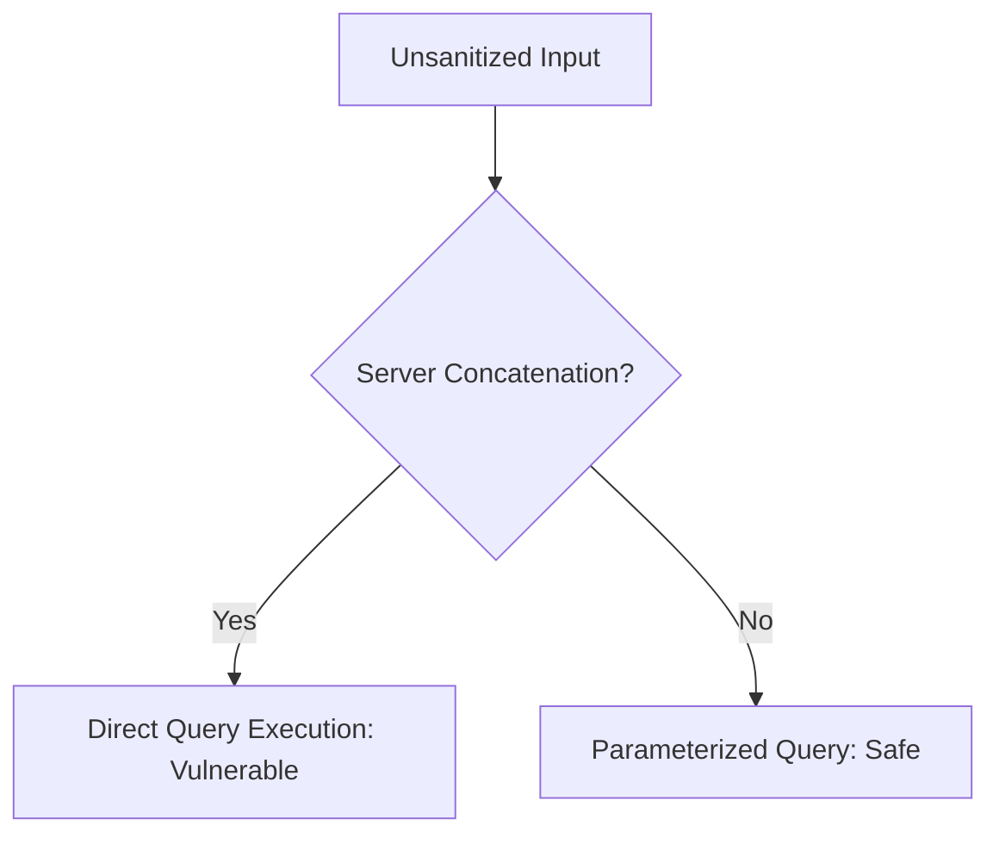

# Lab 01: Linux Basics & Permissions

## Objectives
- Master standard file system navigation.
- Audit permission flags (`rwx`) and learn security implications of `chmod`/`chown` misconfigurations.
- Understand how system services are launched and verified.

## Laboratory Setup
- Local Linux terminal or isolated Docker container running Ubuntu/Alpine.

## Step-by-Step Instructions
1. **Interactive Listing**: Run `ls -lah` in your local directory. Identify the owner and group names.
2. **Permission Modification**: Create a practice script:
   ```bash
   echo "echo 'Target running!'" > test.sh
   ```
   Modify permission so it's readable and executable:
   ```bash
   chmod 755 test.sh
   ./test.sh
   ```
3. **Audit Active Ports**: List listening ports to verify running system processes:
   ```bash
   ss -tulpn
   ```

## Learning Outcomes
- Recognized different permission blocks (User, Group, Others).
- Learned how to read system sockets safely.

## Quiz & Questions
1. *What numerical flag corresponds to read-only permissions?*
   - **Answer**: `4` (or `r--`).
2. *How do you hide standard errors from finding results?*
   - **Answer**: Appending `2>/dev/null` redirection.

---

# Lab 05: Isolated Web Application Analysis

## Objectives
- Learn standard SQL injection syntax structures in safe laboratory code blocks.
- Configure parameterized queries on simulated endpoints.



## Setup Instructions
Use the provided `/docker` environment. Ensure local containers are running:
```bash
docker compose -f docker/docker-compose.yml up -d
```

## Step-by-Step Verification
1. Access the local web target at `http://localhost:8080`.
2. Inspect the search interface.
3. Test with standard single quotes `'` to see if the database engine throws structured parsing errors (an indicator of non-parameterized concatenation).
4. Remediate the input parameters in code by using structured placeholders.

## Cleanup
Stop the container environment:
```bash
docker compose -f docker/docker-compose.yml down
```
